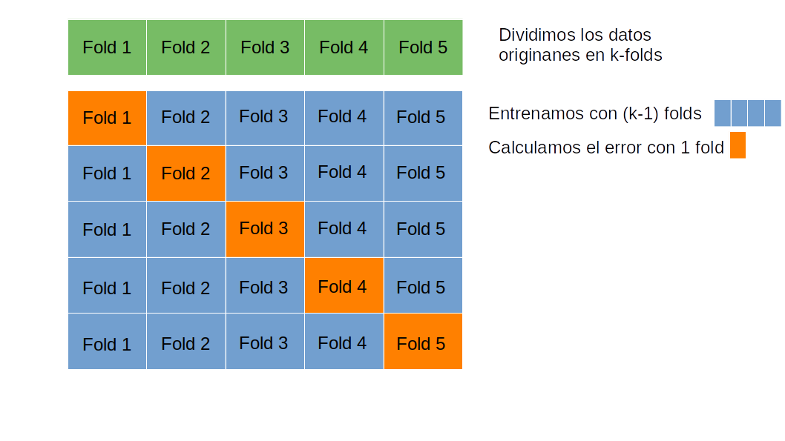

### Regularización

Si el modelo es demasiado complejo ocurre el **sobreajuste** el modelo aprende
sobre el ruido de nuestro modelo de entrenamiento y no es capaz de generalizar
bien. Para evitar el sobreajuste(overfitting) se puede recurrir a simplificar el
modelo o a poner limitaciones sobre el mismo. Esto se conoce con el nombre de
regularización.

-   Regularización Lasso o $L$: permite seleccionar los parámetros que más
    afectan al resultado. Se añade la función de coste:

$$
Coste = {1 \over n} \sum_{i=0}^n{(Y-\hat{Y})^2}+\lambda \sum_j | \beta |
$$

-   Regularización Ridge o $L^2$: se evita que los parámetros crezcan demasiado.
    Se añade la función de coste:

$$
Coste = {1 \over n} \sum_{i=0}^n{(Y-\hat{Y})^2}+\lambda \sum_j \beta^2
$$

-   Elástica: Una solución de compromiso entre las dos:

$$
Coste = {1 \over n} \sum_{i=0}^n{(Y-\hat{Y})^2}+ \alpha \lambda \sum_j | \beta |+(1-\alpha)/2 \lambda \sum_j \beta^2
$$

### Ejemplo regularización

Vamos a ver un ejemplo de regresión lineal con tres variables: x0, x1 y x2.

La función que tratamos de modelizar es del tipo:

$$
y=\beta_1+\beta_2·x_1+\beta_3·x_2+\beta_4·x_3
$$

```{r}
#Definimos la función que queremos modelizar en función de beta
myfunction<-function(x_,beta){beta[1]+x_[,1]*beta[2]+x_[,2]*beta[3]+x_[,3]*beta[4]}
```

```{r}
beta_real<-c(3,0.1,-5,4)

set.seed(123)
get_example_data_frame<-function(n=100){    
    x1<-runif(n,min=-10,max=10)
    x2<-rnorm(n,mean=7,sd=9)
    x3<-x1*rnorm(n,mean=3,sd=2)
 
    df<-data.frame(x1,x2,x3)
    df$y=myfunction(df,beta=beta_real)+rnorm(n,mean=0,sd=10)
    df
}
df<-get_example_data_frame()
head(df)
```

```{r}
cor(df)
```

```{r}
library(GGally)
options(repr.plot.height=4,repr.plot.width=6,repr.plot.res = 200)
ggpairs(df)
```

```{r}
model <- lm(y~x1+x2+x3,data=df)
summary(model)
```

```{r}
confint(model)
```

```{r}
library(pracma)
#Definimos una función de optimización que nos permite ver como evoluciona Beta

optim_beta<-function(mymodel,mse,maxiter=1e3,delta=0.0002,beta_0=c(0,0,0,0)){
    
    x_historico<-data.frame(beta1=rep(NA,maxiter),
                            beta2=rep(NA,maxiter),
                            beta3=rep(NA,maxiter),
                            beta4=rep(NA,maxiter),
                            mse=rep(NA,maxiter))
    x_historico[1,]<-c(beta_0,mse(beta_0))

    for (i in 2:maxiter){
        g <- grad(mse,beta_0)        
        beta_new <- beta_0 - g*delta
        beta_0 <- beta_new
        x_historico[i,]<-c(beta_0,mse=mse(beta_0))
    }
    x_historico<-na.omit(x_historico)
    nrow(x_historico)
    x_historico$step=1:nrow(x_historico)
    x_historico
}
```

```{r}
#Definimos la métrica que queremos minimizar, en este caso el error cuadrático medio
mse<-function(beta){
    sum((df$y-myfunction(df[,c('x1','x2','x3')],beta))^2)/nrow(df)    
}
x_historico<-optim_beta(myfunction,mse,maxiter=1e4,delta=0.0005)
```

```{r}
options(repr.plot.height=4,repr.plot.width=8)
g1<-ggplot(x_historico,aes(x=step))+geom_line(aes(y=beta1),color='red')+
    theme(axis.text.x = element_text(angle = 45))+geom_hline(yintercept=beta_real[1],color='black')
g2<-ggplot(x_historico,aes(x=step))+geom_line(aes(y=beta2),color='blue')+
    theme(axis.text.x = element_text(angle = 45))+geom_hline(yintercept=beta_real[2],color='black')
g3<-ggplot(x_historico,aes(x=step))+geom_line(aes(y=beta3),color='green')+
    theme(axis.text.x = element_text(angle = 45))+geom_hline(yintercept=beta_real[3],color='black')
g4<-ggplot(x_historico,aes(x=step))+geom_line(aes(y=beta4),color='orange')+
    theme(axis.text.x = element_text(angle = 45))+geom_hline(yintercept=beta_real[4],color='black')

library(egg)
grid.arrange(g1, g2, g3,g4, nrow = 1)
```

#### Regularización Lasso

Ahora vamos a aplicar una regularización L1 o de Lasso, añadamos el término:

$$
Coste = {1 \over n} \sum_{i=0}^n{(Y-\hat{Y})^2}+\lambda \sum_j | \beta_j |
$$

De los coeficientes $\beta_j$ no tenemos en cuenta la intersección. Notar que:

-   Cuando $\lambda \rightarrow 0$, entonces
    $\beta_{LASSO} \rightarrow \beta_{original mínimos cuadrados}$

-   Cuando $\lambda \rightarrow \infty$, entonces $\beta_{LASSO} \rightarrow 0$

Tratamos de minimizar la suma de todos los demás coeficientes:

```{r}
lambda<-40
lambda<-2
loss_lasso<-function(beta){
    sum((df$y-myfunction(df[,-ncol(df)],beta))^2)/(2*nrow(df))+lambda*sum(abs(beta[-1]))
}
x_historico<-optim_beta(myfunction,loss_lasso,maxiter=1e4)
```

```{r}
options(repr.plot.height=4,repr.plot.width=8)
library(ggplot2)

g1<-ggplot(x_historico,aes(x=step))+geom_line(aes(y=beta1),color='red')+
    theme(axis.text.x = element_text(angle = 45))+geom_hline(yintercept=beta_real[1],color='black')
g2<-ggplot(x_historico,aes(x=step))+geom_line(aes(y=beta2),color='blue')+
    theme(axis.text.x = element_text(angle = 45))+geom_hline(yintercept=beta_real[2],color='black')
g3<-ggplot(x_historico,aes(x=step))+geom_line(aes(y=beta3),color='green')+
    theme(axis.text.x = element_text(angle = 45))+geom_hline(yintercept=beta_real[3],color='black')
g4<-ggplot(x_historico,aes(x=step))+geom_line(aes(y=beta4),color='orange')+
    theme(axis.text.x = element_text(angle = 45))+geom_hline(yintercept=beta_real[4],color='black')

library(egg)
grid.arrange(g1, g2, g3,g4, nrow = 1)
```

La regularización **Lasso** descarta los componentes que tienen menos certeza en
el resultado final, es decir, los coeficientes con un pvalor más alto.

En R existe el paquete
[glmnet](https://web.stanford.edu/~hastie/glmnet/glmnet_alpha.html) que te
permite apilcar regularización a modelos lineales

```{r}
library(glmnet)
model<-glmnet(as.matrix(df[,c('x1','x2','x3')]),as.matrix(df[,'y']),lambda=2,alpha=1, standardize=F)
coefficients(model)
```

```{r}
model
```

Una vez que nos decantamos por una regularización Lasso ¿Cómo obtenemos el valor
óptimo de $\lambda$ ?

```{r}
fit<-glmnet(as.matrix(df[,c('x1','x2','x3')]),as.matrix(df[,'y']),alpha=1, standardize=F)
par(mfrow=c(1,3))
plot(fit,label=TRUE)
grid()
plot(fit,label=TRUE,xvar="lambda")
grid()
plot(fit,label=TRUE,xvar="dev")
grid()
#print(fit)
```

```{r}
#Calculamos los coeficientes para un valor dado de lambda
l<-exp(6)
coef(fit,s=l)
#Mostramos el valor de R^2 que se corresponde con la Fracción de la desviación típica explicada
caret::postResample(predict(fit,newx=as.matrix(df[,c('x1','x2','x3')]),s=l),df$y)
```

Podemos ir probando con varios valores de $\lambda$ hasta encontrar con el
*óptimo*.

```{r}
lambda1 <- 2
lambda2 <- round(exp(6))
df_test<-get_example_data_frame(n=100)
df_test[,c("pred1","pred2")]<-predict(fit,newx=as.matrix(df_test[,c('x1','x2','x3')]),s=c(lambda1,lambda2))
head(df_test)
ggplot(df_test,aes(x=y))+
    geom_point(aes(y=pred1,color=paste0("lambda=",lambda1)))+
    geom_point(aes(y=pred2,color=paste0("lambda=",lambda2)))+
    geom_abline(slope=1,intercept=0,color="gray")+
    scale_colour_discrete(name = "Valor lambda" )+
    ylab("prediction")+xlab("real")
```

Busca el mejor elemento utilizando validación cruzada (*cross-validation*):



```{r}
cvfit<-cv.glmnet(as.matrix(df[,c('x1','x2','x3')]),as.matrix(df[,'y']),nfolds=10,alpha=1, standarize=F)
plot(cvfit)
```

El modelo que tiene un error cuadrático medio más bajo aparece en la variable
*cvfit\$lambda.min*

El modelo que tiene un mayor valor de $\lambda$ cuya varianza del error está
dentro de 1 *desviación típica* del *mínimo* aparece en la variable
*cvfit\$lambda.1se*.

Al hacer cross-validation el MSE no será un valor único sino que tendremos
*nfolds* diferentes. De todos estos MSE podemos calular la *media* y la
*desviación típica*. El valor de *lambda.1se* viene a significar como el modelo
más sencillo ($\lambda$ más alto) que no se diferencia considerablemente del
*mínimo*.

```{r}
lamda_se<-1
qsd009<-function(x){    
    out<-dnorm(x)
    out[x> lamda_se  | x< -lamda_se  ]<-NA
    out
}
xdf<-data.frame(z=c(-4,4))
ggplot(xdf,aes(x=z))+stat_function(fun=dnorm)+
  stat_function(fun=qsd009, geom="area",fill="red")+
  geom_text(x=0,y=0.2,size=4,label=paste0(100*round(pnorm(lamda_se)-pnorm(-lamda_se),4),"%"))+  
  theme_linedraw()
options(repr.plot.height=7,repr.plot.width=7)
```

```{r}
cvfit$lambda.min
cvfit$lambda.1se
```

```{r}
coef(cvfit, s = "lambda.1se")
```

Su R\^2 estimado será:

```{r}
cvfit$glmnet.fit$dev.ratio[which(cvfit$glmnet.fit$lambda == cvfit$lambda.1se)] 
```

En resumen, para hacer una predicción Lasso con glmnet haríamos:

```{r}

cvfit<-cv.glmnet(as.matrix(df[,c('x1','x2','x3')]),as.matrix(df[,'y']),nfolds=10,alpha=1, standarize=F)

df_test<-get_example_data_frame(n=100)
df_test[,c("pred")]<-predict(cvfit,newx=as.matrix(df_test[,c('x1','x2','x3')]),s=cvfit$lambda.1se)
head(df_test)
caret::postResample(df_test$pred, df_test$y)
```

#### Regularización Ridge

Ahora vamos a aplicar una regularización L2 o Ridge, añadamos el término:

$$
Coste = {1 \over n} \sum_{i=0}^n{(Y-\hat{Y})^2}+\lambda \sum_j \beta_j^2
$$

De los coeficientes $\beta_j$ no tenemos en cuenta la intersección. Notar que:

-   Cuando $\lambda \rightarrow 0$, entonces
    $\beta_{RIDGE} \rightarrow \beta_{original mínimos cuadrados}$

-   Cuando $\lambda \rightarrow \infty$, entonces $\beta_{RIDGE} \rightarrow 0$

Tratamos de minimizar la suma de todos los demás coeficientes:

```{r}
lambda<-10
#lambda<-1000
loss_ridge<-function(beta){
    mean((df$y-myfunction(df[,c('x1','x2','x3')],beta))^2)+lambda*sum(beta[c(2,3,4)]^2)
}

x_historico<-optim_beta(myfunction,loss_ridge,maxiter=1e4,delta=0.0005 )
```

```{r}
options(repr.plot.height=4,repr.plot.width=8)
library(ggplot2)

g1<-ggplot(x_historico,aes(x=step))+geom_line(aes(y=beta1),color='red')+
    theme(axis.text.x = element_text(angle = 45))+geom_hline(yintercept=beta_real[1],color='black')
g2<-ggplot(x_historico,aes(x=step))+geom_line(aes(y=beta2),color='blue')+
    theme(axis.text.x = element_text(angle = 45))+geom_hline(yintercept=beta_real[2],color='black')
g3<-ggplot(x_historico,aes(x=step))+geom_line(aes(y=beta3),color='green')+
    theme(axis.text.x = element_text(angle = 45))+geom_hline(yintercept=beta_real[3],color='black')
g4<-ggplot(x_historico,aes(x=step))+geom_line(aes(y=beta4),color='orange')+
    theme(axis.text.x = element_text(angle = 45))+geom_hline(yintercept=beta_real[4],color='black')

library(egg)
grid.arrange(g1, g2, g3,g4, nrow = 1)
```

La regularización **Ridge** acerca los coeficientes de las variables más
correladas el uno hacia al otro.

También podemos usar el paquete
[glmnet](https://web.stanford.edu/~hastie/glmnet/glmnet_alpha.html), en este
caso con $\alpha=0$ ya que utiliza la siguiente función de coste: $$
Coste = {1 \over n} \sum_{i=0}^n{(Y-\hat{Y})^2}+ \alpha \lambda \sum_j | \beta_j |+(1-\alpha)/2 \lambda \sum_j \beta_j^2
$$

```{r}
library(glmnet)
model<-glmnet(as.matrix(df[,c('x1','x2','x3')]),as.matrix(df[,'y']),lambda=20,alpha=0, standardize=F)
coefficients(model)
```

```{r}
fit<-glmnet(as.matrix(df[,c('x1','x2','x3')]),as.matrix(df[,'y']),alpha=0, standardize=F)

par(mfrow=c(1,3))
plot(fit,label=TRUE)
plot(fit,label=TRUE,xvar="lambda")
plot(fit,label=TRUE,xvar="dev")
grid()
#print(fit)
```

```{r}
cvfit<-cv.glmnet(as.matrix(df[,c('x1','x2','x3')]),as.matrix(df[,'y']),nfolds=10,alpha=0, standardize=F)
plot(cvfit)
```

El modelo que tiene un error cuadrático medio más bajo aparece en la variable
*cvfit\$lambda.min*

El modelo que tiene un mayor valor de $\lambda$ cuya varianza del error está
dentro de 1 *desviación típica* del *mínimo* aparece en la variable
*cvfit\$lambda.1se*.

Al hacer cross-validation el MSE no será un valor único sino que tendremos
*nfolds* diferentes. De todos estos MSE podemos calular la *media* y la
*desviación típica*. El valor de *lambda.1se* viene a significar como el modelo
más sencillo ($\lambda$ más alto) que no se diferencia considerablemente del
*mínimo*.

```{r}
cvfit$lambda.min
cvfit$lambda.1se
```

```{r}
coef(cvfit, s = "lambda.1se")
```

```{r}
cvfit$glmnet.fit$dev.ratio[which(cvfit$glmnet.fit$lambda == cvfit$lambda.1se)] 
```

En resumen, para hacer una predicción Ridge con glmnet haríamos:

```{r}

cvfit<-cv.glmnet(as.matrix(df[,c('x1','x2','x3')]),as.matrix(df[,'y']),nfolds=10,alpha=0, standardize=F)

df_test<-get_example_data_frame(n=100)
df_test[,c("pred")]<-predict(cvfit,newx=as.matrix(df_test[,c('x1','x2','x3')]),s=cvfit$lambda.1se)
head(df_test)
caret::postResample(df_test$y,df_test$pred)
```

### Prediciendo la dureza del hormigón con regularización

Resumen: El hormigón es el material más importante en la ingeniería civil. La
resistencia a la compresión del hormigón es una función altamente no lineal de
la edad y ingredientes Estos ingredientes incluyen cemento, escoria de alto
horno, cenizas volantes, agua, superplastificante, agregado grueso y agregado
fino.

Fuente: https://archive.ics.uci.edu/ml/datasets/Concrete+Compressive+Strength

```{r}
concrete<-read.csv("data/Concrete_Data.csv",
                   col.names=c("cemento","escoria","cenizas","agua","plastificante","aggrueso","agfino","edad","resistencia"))
head(concrete)
```

```{r}
options(repr.plot.height=5,repr.plot.width=8,repr.plot.res = 200)

GGally::ggpairs(concrete, 
       #lower = list(continuous = GGally::wrap("density", alpha = 0.8,size=0.2,color='blue'))
       lower = list(continuous = GGally::wrap("points", alpha = 0.3,size=0.1,color='blue'))
       )
```

```{r}
suppressPackageStartupMessages(library(ggplot2))
suppressPackageStartupMessages(library(dplyr))
suppressPackageStartupMessages(library(glmnetUtils))
```

```{r}
set.seed(12)

idx<-sample(1:nrow(concrete),nrow(concrete)*0.7)

concrete.train=concrete[idx,]
concrete.test=concrete[-idx,]
```

**Regresión lineal**

```{r}
lm_model<-lm(resistencia~
           cemento*escoria*agua*plastificante*aggrueso*agfino*edad*cenizas,data = concrete.train)
    
lm_yp_train<-predict(lm_model,concrete.train)

lm_yp_test<-predict(lm_model,concrete.test)

print("")
caret::postResample(pred=lm_yp_train, obs=concrete.train$resistencia)
caret::postResample(pred=lm_yp_test, obs=concrete.test$resistencia)
```

**Regularización**

En este caso tenemos variables que provienen de diferentes unidades y tienen
rangos muy diferentes de valores, por lo tanto para hacer los coeficientes
comparables entre si, deberíamos estandarizarlos.

El resultado consiste en dejar nuestros datos con media 0 y varianza 1: $$
X_n=\frac{X-\mu}{\sigma}
$$

esto lo realiza por si solo el paquete glmnet o glmnetutils

```{r}
cv<-glmnetUtils::cv.glmnet(formula=resistencia~cemento*escoria*cenizas*agua*plastificante*aggrueso*agfino*edad,
                            data=concrete.train,alpha=1,
                            nfold= 10,
                            type.measure="mse",
                            standardize = T)
ggplot(data.frame(lambda=cv$lambda,cross_validated_mean_error=cv$cvm),
       aes(x=lambda,y=cross_validated_mean_error))+geom_line()
paste0("El valor lambda con el menor error es:",cv$lambda.min)
paste0("El valor lambda más alto que se encuentra a una distancia 1sd es:",cv$lambda.1se)
paste0("El R^2 estimado es ", cv$glmnet.fit$dev.ratio[which(cv$glmnet.fit$lambda == cv$lambda.1se)]) 
ggplot(data.frame(lambda=cv$lambda,r2=cv$glmnet.fit$dev.ratio),
       aes(x=lambda,y=r2))+geom_line()+xlim(0,1)
```

```{r}
reg_yp_train <- predict(cv,
                     concrete.train, 
                     s=cv$lambda.min)
caret::postResample(reg_yp_train,concrete.train$resistencia)
```

```{r}
reg_yp_test <- predict(cv,
                     concrete.test, 
                     s=cv$lambda.min)
caret::postResample(reg_yp_test,concrete.test$resistencia)
```

$$
MSE = {1 \over n} \sum_{i=0}^n{(y_i-y_i')^2}
$$ $$
R^2=1-\frac{\sum_i (y_i-y_i')^2}{\sum_i (y_i-\bar{y})^2}
$$

```{r}
residual_test <- concrete.test$resistencia-reg_yp_test
plot(concrete.test$resistencia,residual_test)
qqnorm(residual_test)
qqline(residual_test,col="orange")
```

```{r}
data.frame(real=concrete.test$resistencia,
                       lm=lm_yp_test,
                       reg=reg_yp_test[,1]) %>% 
   mutate(res_lm=real-lm) %>% 
   mutate(res_reg=real-reg) -> total_pred
head(total_pred)
```

```{r}
library(reshape2)

total_pred |> select(res_lm,res_reg) |> melt() |>
  ggplot(aes(x=value,color=variable))+geom_density()

```

```{r}
total_pred %>% ggplot(aes(x=real))+
  geom_point(aes(y=res_reg,color="Reg"),alpha=0.5)+
  geom_point(aes(y=res_lm,color="Lm"),alpha=0.5)+geom_abline(intercept = 0,slope=0)
```

**Si utilizamos lambda.1se como valor de lambda** el R² y el MSE empeoran
ligeramente, pero siguen siendo mejores que la regresión lineal.

```{r}
reg_yp_train <- predict(cv,
                     concrete.train, 
                     s=cv$lambda.1se)
caret::postResample(reg_yp_train,concrete.train$resistencia)

reg_yp_test <- predict(cv,
                     concrete.test, 
                     s=cv$lambda.1se)
caret::postResample(reg_yp_test,concrete.test$resistencia)

data.frame(real=concrete.test$resistencia,
                       lm=lm_yp_test,
                       reg=reg_yp_test[,1]) %>% 
   mutate(res_lm=real-lm) %>% 
   mutate(res_reg=real-reg) -> total_pred

total_pred %>% select(res_lm,res_reg) %>% melt() %>% 
  ggplot(aes(x=value,color=variable))+geom_density()
```

```{r}
#¿Tiene sesgo nuestro modelo?
colMeans(total_pred[,c("res_lm","res_reg")])
```
