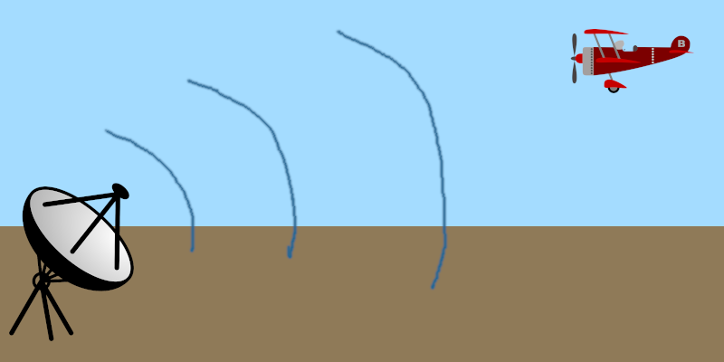
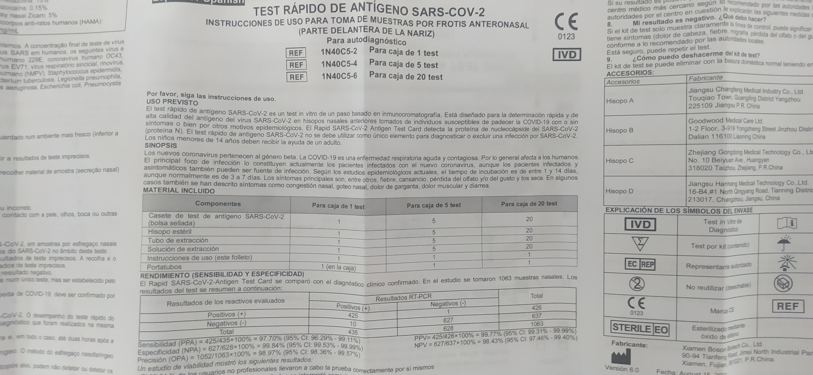

# Regresión logística

En lugar de realizar una predicción de un valor queremos hacer un clasificador.

Si lo que tenemos son dos grupos y queremos realizar una clasificación, tenemos
que realizar ciertas modificaciones a la regresión lineal.

La fórmula de la regresión lineal es: $$
\hat{Y}=\beta_1 X_1+\beta_2 X_2+\cdots +\beta_p X_p = \sum \beta_k X_k
$$

Podemos tratar de asignar una probabilidad. Pero hay un problema porque esta
regresión va entre 0 y 1.

Por ejemplo: Trabajamos en un RADAR y queremos saber si hemos detectado un avión
a es solo ruido.



```{r}
options(repr.plot.height=4,repr.plot.width=8,repr.plot.res = 300)

library(ggplot2)

radar<-read.csv("data/radar-lite.csv", stringsAsFactors = T)
summary(radar)
ggplot(radar,aes(x=distancia,y=potencia,color=tipo))+geom_point(size=3)+
 ylab("potencia [mW]")+xlab("distancia [Km]")
```

```{r}
radar$tipo<-relevel(radar$tipo,ref="ruido")
summary(radar)
```

Podemos hacer una clasificación con un modelo lineal donde creamos una nueva
columna *tipo.n* y le asignamos:

-   avión = 1
-   ruido = 0

Utilizamos un modelo lineal tal que:

$$
  tipo.n = \beta_0+\beta_1·distancia+\beta_2·potencia
$$

Entonces:

-   si tipo.n \>= 0.5 es un avión
-   si tipo.n \< 0.5 es ruido

La recta que marcará el umbral será: $$
\begin{split}    
  0.5 &= \beta_0+\beta_1·distancia+\beta_2·potencia \\
  -\beta_2 potencia &= \beta_0+\beta_1·distancia - 0.5\\
  potencia &= \frac{0.5-\beta_0}{\beta_2}-\frac{\beta_1}{\beta_2}·distancia
\end{split}  
$$

```{r}
set.seed(1)
set.seed(2)

radar$tipo.n[radar$tipo=="avion"] <- 1
radar$tipo.n[radar$tipo=="ruido" ]<- 0


itrain<-sample(1:nrow(radar),round(nrow(radar)*0.7))
radar.train<- radar[itrain,]
radar.test <- radar[-itrain,]


modellm<-lm(data=radar.train,formula=tipo.n~distancia+potencia)
beta<-modellm$coefficients

ggplot(radar.train,aes(x=distancia,y=potencia,color=tipo))+geom_point(size=3)+
 geom_abline(intercept = (0.5-beta[1])/beta[3],slope = -beta[2]/beta[3], color="red" )
```

Pero esto no es del todo correcto porque los datos **NO** siguen una
distribución gaussiana. Siguen una distribución **binomial** con dos posibles
valores 0 o 1.

La distribución binomial es una generalización de la distribución de Bernoulli
para $n$ sucesos independientes, cada uno de los cuales tiene dos posibles
resultados Si/No con probabilidad $p$.

**Ejemplo:** Tiramos al aire 3 monedas y mirarmos cual es la probabilidad de que
2 salgan cara.

Variables que definen la distribución:

-   p - probabilidad de éxito de un caso individual
-   n - número de eventos totales que se desean medir
-   k - número de eventos que ha salido SI.

Estimadores **media** ($\mu$) y **varianza** ($\sigma^2$):

$$
\mu=n·p \qquad
\sigma^2=n·p·(1-p)
$$

Si tenemos $n$ sucesos independientes que siguen una distribución de Bernoulli,
¿cual es la probabilidad de que $k$ sucesos sean positivos?. Si sabemos que la
probabilidad de un suceso ($k=1$) que sigue una distribución Bernoulli viene
dada por la función de distribución:

$$
Pr_{Bernoulli}(X=k)=p^k(1-p)^{n-k} \qquad k \in \left\{0,1 \right\}.
$$

Al tener $k$ sucesos donde $k \in \left\{0,1,2,...,n \right\}$, la función será
la de Bernoulli multiplicada por el coeficiente binomial que acabamos de ver:

$$
Pr(X=k)=\binom{n}{k}p^k(1-p)^{n-k}
$$

La función acumulativa será: $$
Pr(X \leq k)= \sum_{i=0}^{k-1} \binom{n}{k}p^k(1-p)^{n-k}
$$

#### función de enlace (link function)

Para pasar del dominio de números reales $(-\infty,\infty)$ al de probabilidades
$[0,1]$ a vamos a utilizar la **función logística**: $$
p = h(x)=  \frac{1}{1+e^{-x}}
$$ Su inversa se conoce como la función **logit**:

$$
h^{-1}(p) = log \left( \frac{p}{1-p} \right)
$$

```{r}
x<-seq(-10,10,length.out = 100)
y<-1/(1+exp(-x))
plot(x,y,t="l")
```

Es decir, cuando estemos trabajando con una **distribución binomial** un modelo
lineal del tipo: $$
y = \beta \vec{x}+\beta_0
$$ será: $$
y = p(x) = \frac{1}{1+e^{-\beta \vec{x}-\beta_0}} 
$$ Ahora $p(x)$ es una función que muestra valores en el rango $[0,1]$, puede
ser considerada como una probabilidad.

Y tenemos el siguiente clasificador:

-   Seleccionamos clase 1 si p(x)\>=0.5
-   Seleccionamos clase 0 si p(x)\< 0.5

Es decir, tenemos una probabilidad, su valor está en el rango $[0,1]$: $$
    p = \frac{1}{1+e^{-\hat{Y}}}= \frac{1}{1+e^{-(\beta_1 X_1+\beta_2 X_2+\cdots +\beta_p X_p)}}   
$$

Definimos la razón de monomios (Odds ratio) como el cociente entre dos
probabilidades, su valor está en el rango $[0,\infty]$: $$
Odds=\frac{p(x)}{1-p(x)} = \frac{\frac{1}{1+e^{-\beta \vec{x}-\beta_0}}}{1-\frac{1}{1+e^{-\beta \vec{x}-\beta_0}} }
$$

$$
Odds=\frac{p(x)}{1-p(x)} = \frac{1}{1+e^{-\beta \vec{x}-\beta_0}-1} 
$$

$$
Odds=\frac{p(x)}{1-p(x)} = e^{\beta \vec{x}+\beta_0}
$$

$$
 Odds = \frac{p}{1-p}=\frac{\frac{1}{1+e^{-(\beta_1 X_1+\beta_2 X_2+\cdots +\beta_p X_p)}}}{\frac{e^{-(\beta_1 X_1+\beta_2 X_2+\cdots +\beta_p X_p)}}{1-e^{-(\beta_1 X_1+\beta_2 X_2+\cdots +\beta_p X_p)}}}=e^{(\beta_1 X_1+\beta_2 X_2+\cdots +\beta_p X_p)}
$$

Si aplicamos el logaritmo a la razón de monomios tenemos un valor que está en el
rango $[-\infty,\infty]$: $$
 log(Odds)= log \left(\frac{p}{1-p} \right) = \beta_1 X_1+\beta_2 X_2+\cdots +\beta_p X_p
$$

La función de coste que vamos a tratar de minimizar será: $$
\begin{split}
Cost(p(x),y) &= {1 \over n} \sum_{i=0}^n{(y-\hat{y})^2}\\
Cost(p(x),y) &= {1 \over n} \sum_{i=0}^n{(y-p(x))^2}
\end{split}
$$ Que transformaremos en: $$
Cost(p(x),y) = -y ·log(p(x))-(1-y)·log(1-p(x))
$$

```{r}
summary(radar.train)
summary(radar.test)
```

```{r}
model<-glm(data=radar.train,formula=tipo~distancia+potencia,family=binomial(link='logit'))

betalg<-model$coefficients

ggplot(radar.train,aes(x=distancia,y=potencia,color=tipo))+geom_point(size=3)+
 geom_abline(intercept = (0.5-beta[1])/beta[3],slope = -beta[2]/beta[3], color="red" )    +
 geom_abline(intercept = -betalg[1]/betalg[3],slope = -betalg[2]/betalg[3], color="blue" )
```

La salida del modelo es log(odds): $$
 y = log(Odds) = \beta_1 X_1+\beta_2 X_2+\cdots +\beta_p X_p
$$ Si queremos la probabilidad tenemos que aplicar un poco de cálculo: $$
 Odds = \frac{p}{1-p}
$$ $$
 y = log(Odds) = log \left( \frac{p}{1-p} \right) \\
 e^y = \left( \frac{p}{1-p} \right) \\
 e^y·(1-p) = p \\
 e^y = p+p·e^y \\
 e^y = p·(1+e^y) \\
 p=\frac{e^y}{1+e^y}
$$

```{r}
out<-radar.test
out["y"]<-predict(model,radar.test)

ggplot(out,aes(x=y,color=tipo))+geom_histogram(aes(fill=tipo))+xlab("log(odds)")
```

```{r}
out<-radar.test
out["y"]<-predict(model,radar.test)
out["probs"]<-exp(out["y"])/(1+exp(out["y"]))
out["probs"]<-1/(1+exp(-out["y"]))

ggplot(out,aes(x=probs,color=tipo))+geom_histogram(aes(fill=tipo))#geom_density()
```

```{r}
out["probs"]<-predict(model,radar.test,type="response")

ggplot(out,aes(x=probs,color=tipo))+geom_density()
```

## Matriz de confusión

Aqui lo que tenemos es un clasificador con dos hipótesis $H_0$ (hipótesis
negativa) y $H_1$ (hipótesis positiva). Si nuestro test estadístico dice que la
hipótesis $H_1$ es cierta pero en realidad la que es cierta es la hipótesis
$H_0$ estaremos cometiendo un error. El tipo de error depende de si nos hemos
equivocado prediciendo $H_0$ o $H_1$.

| .            | Elegimos $H_0$                | Elegimos $H_1$               |
|--------------|-------------------------------|------------------------------|
| $H_0$ cierta | No hay error                  | Error tipo I, falso positivo |
| $H_1$ cierta | Error tipo II, falso negativo | No hay error                 |

La matriz de confusión lo que hace es contar el número de ocurrencias que ha
habido en cada celda:

```{r}
M<-matrix(rep(0,4),ncol = 2)
umbral <- 2
radar_pred  <- predict(model,radar.test)
y_est=factor(ifelse(radar_pred < umbral,0,1),labels=c("ruido","avion"))


M = table(real=radar.test$tipo,elegimos=y_est)
M

ggplot(radar.test,aes(x=distancia,y=potencia,color=tipo))+geom_point(size=3)+
 geom_abline(intercept = (-betalg[1])/betalg[3],slope = -betalg[2]/betalg[3], color="blue", linetype="dashed")+
 geom_abline(intercept = (umbral-betalg[1])/betalg[3],slope = -betalg[2]/betalg[3], color="blue" )
```

### Medidas de calidad

Imaginemos que tenemos la siguiente matriz de confusión:

| .                  | Predecimos condición negativa | Predecimos condición positiva |
|--------------------|-------------------------------|-------------------------------|
| Condición negativa | $M_{11}$                      | $M_{12}$                      |
| Condición positiva | $M_{21}$                      | $M_{22}$                      |

**Precisión** : $\frac{M_{22}}{M_{12}+M_{22}}$. Cuantos aciertos tengo del total
de predicciones. Nos habla de **calidad**.

**Exhaustividad** (recall, true positive rate): $\frac{M_{22}}{M_{21}+M_{22}}$.
Que ratio de los aciertos positivos soy capaz de encontrar. Nos habla de
**cantidad** de encuentros.

**Exactitud** (Accuracy): $\frac{M_{11}+M_{22}}{M_{11}+M_{12}+M_{21}+M_{22}}$:
Cuantas predicciones correctas he hecho.

**Valor-F**:
$F_\beta=(1+\beta^2)\frac{Precisión·Exhaustividad}{\beta^2·Precisión+Exhaustividad}$

**Probabilidad de falso positivo** (false positive rate):
$\frac{M_{12}}{M_{12}+M_{11}}$. Cuantos positivos **erróneos** he detectado de
todos los negativos que hay.

A veces la matriz de confusión se muestra cambiada, de hecho Python lo hace así,
intercambia las filas y las columnas. Más información aquí:
https://towardsdatascience.com/the-two-variations-of-confusion-matrix-get-confused-never-again-8d4fb00df308

```{r}
fscore<-function(M,beta){
    pr=M[1,1]/(M[1,2]+M[1,1])
    rc=M[1,1]/(M[2,1]+M[1,1])
    (1+beta^2)*pr*rc/(beta^2*pr+rc)
}

paste("Precision:",M[2,2]/(M[1,2]+M[2,2]))
paste("Recall, true positive rate:",   M[2,2]/(M[2,1]+M[2,2]))
paste("False positive rate:",   M[1,2]/(M[1,2]+M[1,1]))
paste("Accuracy:", (M[1,1]+M[2,2])/(M[1,1]+M[1,2]+M[2,1]+M[2,2]))
paste("F0.5-score",fscore(M,0.5))
paste("F1-score",fscore(M,1))
paste("F2-score",fscore(M,beta=2))
```

## Curva ROC

La curva ROC fue comenzada a usar durante la segunda guerra mundial para el
análisis de las señales de radar. Después del ataque de Pearl Harbor en 1941, la
armada de EEUU comenzó un programa de investigación para aumentar la predicción
de los radares a la hora de detectar aviones japoneses. Para ello midieron la
habiliad de un radar de detectar esas señales, esa medida la llamaron "Receiver
Operating Characteristic".

Se utiliza para ver la calidad de un detector, un clasificador binario capaz de
detectar un elemento. Se hace un barrido por todos los umbrales y se mide el
valor de positivo verdadero en función de falso positivo.

```{r}
umbral<- 2
radar_pred  <-predict(model,radar.test)

df_preds<-data.frame(pred=radar_pred,
                     tipo_pred=factor(ifelse(radar_pred < umbral,0,1),labels=c("ruido","avion")),
                     tipo_real=radar.test$tipo)
df_preds<-df_preds[order(df_preds$pred, decreasing=FALSE),]

M<-table(df_preds$tipo_real,df_preds$tipo_pred)
 #table(real=radar.test$tipo,elegimos=y_est)

#Recall, Exhaustividad, Tasa Verdadero positivo
truePositive<-M[2,2]/(M[2,2]+M[2,1]) 

#Tasa Falso positivo
falsePositive<-M[1,2]/(M[1,2]+M[1,1])
paste("tp:",truePositive,"  fp:",falsePositive)
M

df_preds
```

```{r}
calctp_fp<-function(y_predict,y_real,th){
    y_est<-ifelse(y_predict<th,0,1)

    M<-table(y_real,y_est)
    #print(M)
    if (ncol(M)==2 && nrow(M)==2){
        truePositive<-M[2,2]/(M[2,2]+M[2,1])                     
        falsePositive<-M[1,2]/(M[1,2]+M[1,1])
        c(tp=truePositive,fp=falsePositive)
    }else{
        c(tp=NA,fp=NA)
    }
}
```

```{r}
calctp_fp(df_preds$pred,df_preds$tipo_real,th=-1)
```

```{r}
dfROC<-data.frame(th=unique(df_preds$pred),tp=NA,fp=NA,model="model1")

#for (th in seq(min(df_preds$pred),max(df_preds$pred),length.out=10)){
#    calctp_fp(df_preds$pred,df_preds$tipo_real,th=th)
#}
for (i in 1:nrow(dfROC)){
    v<-calctp_fp(df_preds$pred,df_preds$tipo_real,th=dfROC$th[i])
    dfROC$tp[i]<-v["tp"]
    dfROC$fp[i]<-v["fp"]
}
ggplot(data=dfROC,aes(x=fp,y=tp))+geom_path()
```

La curva ROC sale tan escalonada porque tenemos pocas muestras. Vamos a probar
con un dataset más grande:

```{r}
radar_big<-read.csv("data/radar.csv", stringsAsFactors = T)
radar_big$tipo<-relevel(radar_big$tipo,ref="ruido")

set.seed(123)
itrain<-sample(1:nrow(radar_big),round(nrow(radar_big)*0.7))
radar_big.train<- radar_big[itrain,]
radar_big.test <- radar_big[-itrain,]
summary(radar_big.train)
summary(radar_big.test)
```

```{r}
model_radar1<-glm(data=radar_big.train,formula=tipo~distancia+potencia,family=binomial())
```

```{r}

df_preds<-data.frame(pred=predict(model_radar1,radar_big.test),                     
                     tipo_real=radar_big.test$tipo)

dfROC<-data.frame(th=unique(df_preds$pred),tp=NA,fp=NA,model="model1")
dfROC<-dfROC[order(dfROC$th),]


for (i in 1:nrow(dfROC)){
    v<-calctp_fp(df_preds$pred,df_preds$tipo_real,th=dfROC$th[i])
    dfROC$tp[i]<-v["tp"]
    dfROC$fp[i]<-v["fp"]
}
ggplot(data=dfROC,aes(x=fp,y=tp))+geom_path()+scale_x_continuous(breaks = seq(0,1, length.out=21))
```

```{r}
library(ROCR)

#p<-predict(model_radar1,radar_big.test,type="response")
p<- predict(model_radar1,radar_big.test)

pr <- prediction(p, radar_big.test$tipo,  label.ordering=c("ruido","avion"))
prf <- performance(pr, measure = "tpr", x.measure = "fpr")
plot(prf, colorize=TRUE)
```

```{r}
model_radar2<-glm(data=radar_big.train,formula=tipo~I(distancia^2)+potencia,
                  family=binomial(link='logit'))
summary(model_radar2)
```

```{r}
p<-  predict(model_radar2,radar_big.test)
pr2 <- prediction(p, radar_big.test$tipo,label.ordering=c("ruido","avion"))
prf2 <- performance(pr2, measure = "tpr", x.measure = "fpr")

plot(prf) 
lines(prf2@x.values[[1]], prf2@y.values[[1]], col = 'red')
legend(0.5,0.8,c("tipo~distancia+potencia","tipo~I(distancia^2)+potencia"), pch=c("-","-"),col=c("black","red"), y.intersp = 2)
```

```{r}
?performance
```

```{r}
prf <- performance(pr, measure = "prec", x.measure = "rec", label.ordering=c("ruido","avion"))
plot(prf,colorize=TRUE)
```

#### AUC

Area bajo la curva (Area Under The Curve), número entre 0 y 1 que mide como de
bueno es un clasificador.

Es el area bajo la curva ROC, cuando su valor es: \* 1 significa que el
clasificador es perfecto \* 0.5 significa que la elección es tan buena como
hacerla al azar \* Menor de 0.5, significa que lo estamos haciendo peor que el
azar

```{r}
pauc1<-performance(pr, measure = "auc", label.ordering=c("ruido","avion"))
pauc1@y.values[[1]]
```

```{r}
pauc2<-performance(pr2, measure = "auc", label.ordering=c("ruido","avion"))
pauc2@y.values[[1]]
```

```{r}
#library(pROC)
rocobj1 <- pROC::roc(
    radar_big.test$tipo,
    predict(model_radar1,radar_big.test))

rocobj2 <- pROC::roc(
    radar_big.test$tipo,
    predict(model_radar2,radar_big.test),
    levels=c("ruido","avion"),direction="<")


#plot(rocobj1, print.auc = TRUE, col = "blue")
#plot(rocobj2, print.auc = TRUE, col = "green", print.auc.y = .4, add = TRUE)

pROC::ggroc(list(model1=rocobj1, model2=rocobj2), alpha = 0.5, size = 2)+ xlab("1-FPR") + ylab("TPR") +
geom_abline(slope = 1 ,intercept = 1, alpha=0.5) +
  scale_colour_manual(values = c("red",  "#0000FF") ,name="Modelo", 
                      labels=c(paste0("Modelo1. AUC:",pROC::auc(rocobj1)),
                               paste0("Modelo2. AUC:",pROC::auc(rocobj2))))
```

### Ejemplo Verrugas

Este conjunto de datos contiene información sobre los resultados del tratamiento
de verrugas de 90 pacientes que utilizan crioterapia.

https://archive.ics.uci.edu/ml/datasets/Cryotherapy+Dataset+

```{r}
cryo<-read.csv('data/Cryotherapy.csv')
cryo$sex<-factor(cryo$sex,labels=c("Mujer","Hombre"))
cryo$Type<-factor(cryo$Type,labels=c("Común","Plantar","Ambas"))
cryo$Result_of_Treatment<-factor(cryo$Result_of_Treatment,labels=c("No","Si"))
summary(cryo)
```

```{r}
set.seed(0)
num_train=round(0.7*nrow(cryo))
train_ind<-sample(1:nrow(cryo),size = num_train)

cryo.train=cryo[train_ind,]
cryo.test =cryo[-train_ind,]
summary(cryo.train)
summary(cryo.test)
```

```{r}
model<-glm(data=cryo.train,formula=Result_of_Treatment~.,family=binomial())
```

```{r}
library(ROCR)
options(repr.plot.height=4,repr.plot.width=6)


p<-predict(model,cryo.test,type="response")

pr <- prediction(p, cryo.test$Result_of_Treatment)
prf <- performance(pr, measure = "tpr", x.measure = "fpr")
plot(prf)
```

```{r}
prf_auc=performance(pr, measure = "auc")
paste("The AUC is",prf_auc@y.values[[1]])
```

```{r}
summary(model)
```

```{r}
library(MASS)
stepAIC(model)
```

```{r}
model<-glm(data=cryo.train,formula=Result_of_Treatment~ age + Time + Type + sex,family=binomial())
summary(model)
```

```{r}
p<-predict(model,cryo.test,type="response")

pr <- prediction(p, cryo.test$Result_of_Treatment)
prf_auc=performance(pr, measure = "auc")
paste("The AUC is",prf_auc@y.values[[1]])
```

```{r}

cvfit<-glmnetUtils::cv.glmnet(Result_of_Treatment~.+age*Time*Type+I(age^2)+I(Time^2),
                              family = "binomial",
                              data=cryo.train,nfolds=10,alpha=0.2)
plot(cvfit)
```

```{r}
p<-predict(cvfit,newdata=cryo.test,s=cvfit$lambda.min)

pr <- prediction(p, cryo.test$Result_of_Treatment)
prf_auc=performance(pr, measure = "auc")
paste("The AUC is",prf_auc@y.values[[1]])
```

### Ejemplo Churn rate

Vamos a utilizar un dataset publicado por IBM en
[kaggle](https://www.kaggle.com/blastchar/telco-customer-churn).

En este ejemplo vamos a cargar el dataset proporcionado y ver si somos capaces
de ver qué usuarios son los que corren más riesgo de irse.

El conjunto de datos incluye información sobre:

-   Clientes que se fueron en el último mes: la columna se llama Churn
-   Servicios para los que se ha registrado cada cliente: teléfono, líneas
    múltiples, Internet, seguridad en línea, copia de seguridad en línea,
    protección de dispositivos, soporte técnico y transmisión de TV y películas
-   Información de la cuenta del cliente: cuánto tiempo han sido cliente
    (columna tenure), contrato, método de pago, facturación electrónica, cargos
    mensuales y cargos totales
-   Información demográfica sobre los clientes: sexo, rango de edad y si tienen
    socios y dependientes

```{r}
dfchurn<-read.csv("data/WA_Fn-UseC_-Telco-Customer-Churn.csv", stringsAsFactors = T)
head(dfchurn)
str(dfchurn)
```

```{r}
dfchurn$OnlineSecurity<-NULL
dfchurn$OnlineBackup<-NULL
dfchurn$DeviceProtection<-NULL
dfchurn$TechSupport<-NULL
dfchurn$StreamingTV<-NULL
dfchurn$StreamingMovies<-NULL
```

```{r}
summary(dfchurn)
```

Vemos que la mayor parte de las columnas son factores. Llama la atención la
columna SeniorCitizen que parece numérica, veamos que valores tiene:

```{r}
unique(dfchurn$SeniorCitizen)
table(dfchurn$SeniorCitizen)
```

Esta columna debería ser un factor, mirando otra parte de la documentación vemos
que:

1 = Si es senior citizen

0 = No es senior citizen

```{r}
dfchurn$SeniorCitizen<-factor(dfchurn$SeniorCitizen,labels = c("No","Yes"))
```

Eliminamos la columna customerID porque no nos hace falta

```{r}
dfchurn$customerID<-NULL
```

```{r}
set.seed(12)
idx<-sample(1:nrow(dfchurn),0.7*nrow(dfchurn))
dfchurn.train<-dfchurn[idx,]
dfchurn.test<-dfchurn[-idx,]
```

```{r}
summary(dfchurn.train)
```

```{r}
model<-glm(data=dfchurn.train,formula=Churn~.,family=binomial())
summary(model)
```

```{r}
library(ROCR)
options(repr.plot.height=4,repr.plot.width=6)
 

df_pred<-data.frame(pred=predict(model,dfchurn.test,type="response"), 
                    real= dfchurn.test$Churn)
df_pred<-na.omit(df_pred)

pr <- prediction(df_pred$pred, df_pred$real)
prf <- performance(pr, measure = "tpr", x.measure = "fpr")
plot(prf)
```

```{r}
prf_auc=performance(pr, measure = "auc")
paste("The AUC is",prf_auc@y.values[[1]])
```

Repasemos la matriz de confusión:

| .                  | Predecimos condición negativa | Predecimos condición positiva |
|--------------------|-------------------------------|-------------------------------|
| Condición negativa | $M_{11}$                      | $M_{12}$                      |
| Condición positiva | $M_{21}$                      | $M_{22}$                      |

**Precisión** : $\frac{M_{22}}{M_{12}+M_{22}}$. Cuantos aciertos tengo del total
de predicciones. Nos habla de **calidad**.

**Exhaustividad** o **sensibilidad** (recall, true positive rate):
$\frac{M_{22}}{M_{21}+M_{22}}$. Que ratio de los aciertos positivos soy capaz de
encontrar. Nos habla de **cantidad** de encuentros.

**Exactitud** (Accuracy): $\frac{M_{11}+M_{22}}{M_{11}+M_{12}+M_{21}+M_{22}}$:
Cuantas predicciones correctas he hecho.

**Valor-F**:
$F_\beta=(1+\beta^2)\frac{Precisión·Exhaustividad}{\beta^2·Precisión+Exhaustividad}$

```{r}
library(caret)
library(e1071)


cf_m<-confusionMatrix(data=factor(predict(model,dfchurn.test,type="response")>0.5,
                                  labels=c("No","Yes")), 
                      reference=dfchurn.test$Churn,
                      positive="Yes")
cf_m
# Más información de como obtener esas figuras:
# https://www.rdocumentation.org/packages/caret/versions/6.0-85/topics/confusionMatrix
```

```{r}
paste("La precisión es:",cf_m$table[2,2]/sum(cf_m$table[2,]))
paste("La exhaustividad (recall, sensitivity) es:",cf_m$table[2,2]/sum(cf_m$table[,2]))
paste("La exactitud (accuracy) es:",(cf_m$table[2,2]+cf_m$table[1,1])/sum(cf_m$table))

bnt_test=binom.test(cf_m$table[2,2]+cf_m$table[1,1],sum(cf_m$table))
paste("El intervalo de confianza de la exactitud es: [",paste0(bnt_test$conf.int,collapse=","),"]")
```

```{r}
library(MASS)
#model<-glm(data=dfchurn.train,formula=Churn~.,family=binomial())

# Nos encuentra el modelo con menor AIC
model_optim_aic<-stepAIC(model, direction="both", trace=0)
```

```{r}
summary(model_optim_aic)
```

El caso de PaymentMethod es bastante curioso: Hay valores para los cuales la
diferencia no es estadísitcamente significativa, pero hay otros que sí.

El único valor estadísticamente significativo parece que es "Electronic check"

Dentro de esta variable categórica vamos a comprobar que valores podemos separar
y cuales agrupar.

```{r}
levels(dfchurn$PaymentMethod)
```

```{r}
tbl_payment<-table( dfchurn[c("Churn","PaymentMethod")])
tbl_payment
```

Hacemos un test chi-cuadrado para corroborar que la probabilidad de churn
depende del método de pago.

```{r}
chisq.test(tbl_payment)
```

El test estadístico nos dice que al menos un método de pago es diferente:

```{r}
prop.table(tbl_payment,margin=2)
```

```{r}
df_payment<-data.frame(apply(tbl_payment,2,function(x){binom.test(x)$conf.int}))
df_payment
```

Podemos juntar todos los grupos en "Electronic check" y "Otro".

```{r}
dfchurn$ElectronicCheck<-factor(dfchurn$PaymentMethod=="Electronic check",labels=c("No","Yes"))
dfchurn.train<-dfchurn[idx,]
dfchurn.test<-dfchurn[-idx,]
```

```{r}
model2<-glm(formula = Churn ~ SeniorCitizen + Dependents + tenure + MultipleLines + 
    InternetService + Contract + PaperlessBilling + ElectronicCheck + 
    TotalCharges, family = binomial(), data = dfchurn.train)
summary(model2)
```

```{r}
cf_m2<-confusionMatrix(factor(predict(model2,dfchurn.test,type="response")>0.5,
                             labels=c("No","Yes")), 
                      dfchurn.test$Churn,positive="Yes")
cf_m2
```

```{r}
paste("La precisión es:",cf_m$table[2,2]/sum(cf_m$table[2,]))
paste("La exhaustividad (recall, sensitivity) es:",cf_m$table[2,2]/sum(cf_m$table[,2]))
paste("La exactitud (accuracy) es:",(cf_m$table[2,2]+cf_m$table[1,1])/sum(cf_m$table))
```

```{r}

df_pred<-data.frame(pred=predict(model2,dfchurn.test,type="response"), 
                    real= dfchurn.test$Churn)
df_pred<-na.omit(df_pred)

pr <- prediction(df_pred$pred, df_pred$real)
prf_auc=performance(pr, measure = "auc")
paste("The AUC is",prf_auc@y.values[[1]])
```

```{r}
cf_m$table
cf_m2$table
```

Se puede profundizar más en estos datos mirando el notebook:

https://www.kaggle.com/farazrahman/telco-customer-churn-logisticregression

## Entendiendo los coeficientes

En la regresión logística, estamos tratando de predecir una variable binaria $Y$
(que toma valores 0 o 1) basándonos en varias variables de entrada
$X_1, X_2, ..., X_n$. La forma básica de la regresión logística se puede
escribir como:

$$
\log \left( \frac{p}{1-p} \right) = \beta_0 + \beta_1X_1 + \beta_2X_2 + ... + \beta_nX_n
$$

Aquí, $p$ es la probabilidad de que $Y=1$, y los $\beta$ son los coeficientes de
la regresión. El término $\frac{p}{1-p}$ es la "razón de monomios" (odds ratio),
y $\ln(\frac{p}{1-p})$ es el logaritmo de la razón de monomios (log-odds).

Cada coeficiente $\beta_i$ representa el cambio en el log-odds para un
incremento unitario en la variable $X_i$, manteniendo constantes las demás
variables. Si $\beta_i$ es positivo, un incremento en $X_i$ aumentará la
probabilidad de que $Y=1$, y si $\beta_i$ es negativo, un incremento en $X_i$
disminuirá la probabilidad de que $Y=1$.

Un incremento unitario en $X_1$ incrementa el logaritmo de la razón de monomios
(log-odds) en $\beta_1$. Para entender cómo esto afecta a la razón de monomios,
necesitamos deshacer el logaritmo.

La relación entre el log-odds y la razón de monomios es:

$$
\frac{p}{1-p} = e^{\ln(\frac{p}{1-p})}
$$

Si sustituimos $\ln(\frac{p}{1-p})$ por
$\beta_0 + \beta_1X_1 + \beta_2X_2 + ... + \beta_nX_n$, obtenemos:

$$
\frac{p}{1-p} = e^{\beta_0 + \beta_1X_1 + \beta_2X_2 + ... + \beta_nX_n}
$$

Recordemos que la relación entre el log-odds y la probabilidad es:

$$
p = \frac{e^{\log(\frac{p}{1-p})}}{1 + e^{\log(\frac{p}{1-p})}} = \frac{1}{1 + e^{-\log(\frac{p}{1-p})}}
$$

### Ejemplo: Peso de los niños al nacer

Este dataset contien información de bebes recien nacidos y sus padres. Podemos
usarlo como clasificación para ver cuales son los factores que más afectan al
niño en función de si la madre es o no fumadora.

Tenemos las siguientes variables que vamos a utilizar:

| Nombre      | Variable                      |
|-------------|-------------------------------|
| Birthweight | Peso al nacer (libras)        |
| Gestation   | Semanas que duró la gestación |
| motherage   | Edad de la madre              |
| smoker      | Madre fumadora 0/1            |

```{r}
bwt<-read.csv("data/birthweight_reduced.csv")
bwt$smoker <- factor(bwt$smoker,labels=c("No","Yes"))
str(bwt)
```

```{r}
model <- glm(data=bwt, formula = smoker~Birthweight + Gestation, family=binomial())
summary(model)
```

```{r}
betalg <- model$coefficients
ggplot(data=bwt, aes(x=Birthweight ,y=Gestation, color=smoker))+geom_point()+
 geom_abline(intercept=-betalg[1]/betalg[3], slope=-betalg[2]/betalg[3],color="blue")
```

Vemos que el valor que más influye en si la madre es fumadora o no es en el peso
del niño al nacer. No parece que afecte mucho al tiempo de gestación.

Podemos calcular la probabilidad de que la madre sea fumadora mirando el peso
del niño y los coeficientes de la regresión logística: $$
    p = \frac{1}{1-e^{-\hat{Y}}}= \frac{1}{1-e^{-(\beta_0+\beta_1 · peso)}}   
$$

```{r}
model <- glm(data=bwt, formula = smoker~Birthweight , family=binomial())
model$coefficients

peso<-seq(4,10,length.out=100)
p <- 1/(1+exp(-(model$coefficients[1]+peso*model$coefficients[2])))
plot(peso,p,t="l",xlab="Peso del niño")
```

```{r}
pesoLibras <- 5
pesoKg <- pesoLibras*0.453592
ods <- predict(model,data.frame(Birthweight=pesoLibras))
print(paste("Para un peso de",pesoKg,"Kg es",exp(ods),
            "veces más probable que la madre sea fumadora"))
print(paste("Para un peso de",pesoKg,
            "Kg la probabilidad de que la madre sea fumadora es de",exp(ods)/(1+exp(ods))))
```

Otra forma de verlo es decir que cada libra que pesa el niño, la razón de
probabilidades de que la madre se fumadora respecto a la que no lo es: $$
log(\frac{p}{1-p})=\beta_0+\beta_1 · peso
$$ $$
\frac{p}{1-p}=e^{\beta_0}·e^{\beta_1 · peso}
$$ Por cada unidad que aumenta el peso, el la razón de probabilidades aumenta
$e^{\beta_1}$

```{r}
peso1 <- 9
peso2 <- 10

p1 <- 1/(1+exp(-(model$coefficients[1]+peso1*model$coefficients[2])))
p2 <- 1/(1+exp(-(model$coefficients[1]+peso2*model$coefficients[2])))

(p2/(1-p2))/(p1/(1-p1))
```

```{r}
exp(model$coefficients[2])
```

### Censo

Dataset de: https://archive.ics.uci.edu/ml/datasets/adult

-   age: continuous.
-   workclass: Private, Self-emp-not-inc, Self-emp-inc, Federal-gov, Local-gov,
    State-gov, Without-pay, Never-worked.
-   fnlwgt: continuous.
-   education: Bachelors, Some-college, 11th, HS-grad, Prof-school, Assoc-acdm,
    Assoc-voc, 9th, 7th-8th, 12th, Masters, 1st-4th, 10th, Doctorate, 5th-6th,
    Preschool.
-   education-num: continuous.
-   marital-status: Married-civ-spouse, Divorced, Never-married, Separated,
    Widowed, Married-spouse-absent, Married-AF-spouse.
-   occupation: Tech-support, Craft-repair, Other-service, Sales,
    Exec-managerial, Prof-specialty, Handlers-cleaners, Machine-op-inspct,
    Adm-clerical, Farming-fishing, Transport-moving, Priv-house-serv,
    Protective-serv, Armed-Forces.
-   relationship: Wife, Own-child, Husband, Not-in-family, Other-relative,
    Unmarried.
-   race: White, Asian-Pac-Islander, Amer-Indian-Eskimo, Other, Black.
-   sex: Female, Male.
-   capital-gain: continuous.
-   capital-loss: continuous.
-   hours-per-week: continuous.
-   native-country: United-States, Cambodia, England, Puerto-Rico, Canada,
    Germany, Outlying-US(Guam-USVI-etc), India, Japan, Greece, South, China,
    Cuba, Iran, Honduras, Philippines, Italy, Poland, Jamaica, Vietnam, Mexico,
    Portugal, Ireland, France, Dominican-Republic, Laos, Ecuador, Taiwan, Haiti,
    Columbia, Hungary, Guatemala, Nicaragua, Scotland, Thailand, Yugoslavia,
    El-Salvador, Trinadad&Tobago, Peru, Hong, Holand-Netherlands.

```{r}
adult<-read.csv("data/adult.data.txt",
                col.names=c("age","workclass","fnlwgt","education","education-num","marital-status",
                           "occupation","relationship","race","sex","capital-gain","capital-loss","hours-per-week",
                           "native-country","50k"), stringsAsFactor=T)

str(adult)
```

```{r}
levels(adult$education)
numlevels<-length(levels(adult$education))
adult$education<-factor(adult$education,levels(adult$education)[c(4,5,6,7,1,2,3,8:numlevels)])
```

```{r}
levels(adult$education)
```

```{r}
model <- glm(data=adult, formula=X50k ~ age+education+sex, family = binomial())
model
```

```{r}
paste("Un hombre tiene ",exp(model$coefficients["sex Male"]),"veces más posibilidades de ganar más de 50k$ que una mujer")
```

```{r}
paste("Cada año que pasa hay ",exp(model$coefficients["age"]),"veces más posibilidades de ganar más de 50k$")
```

```{r}
paste("Una persona con Master tiene ",exp(model$coefficients["education Masters"]),"veces más posibilidades de ganar más de 50k$ que alguien con solo 1st-4th")
```

```{r}
adult_master<-subset(adult,education==" Masters")
model <- glm(data=adult_master, formula=X50k ~ age+sex, family = binomial())
summary(model)
```

```{r}
model <- glm(data=adult_master, formula=X50k ~ age*sex, family = binomial())
summary(model)
```

```{r}
confint(model)
```

### Análisis matriz confusión test SARS-Covid-2

En la siguiente imagen tenemos el prospecto de un test covid:



| .                | Resultado PCR + | Resultado PCR - | Total |
|------------------|-----------------|-----------------|-------|
| Test antígenos + | 425             | 1               | 426   |
| Test antígenos - | 10              | 627             | 637   |
| Total            | 435             | 628             | 1063  |

Repasemos la matriz de confusión:

| .                             | condición negativa | condición positiva |
|-------------------------------|--------------------|--------------------|
| Predecimos Condición negativa | $M_{11}$           | $M_{12}$           |
| PredecimosCondición positiva  | $M_{21}$           | $M_{22}$           |

**Precisión** : Cuantos aciertos tengo del total de predicciones. Nos habla de
**calidad**.

**Exhaustividad** (recall, true positive rate). Que ratio de los aciertos
positivos soy capaz de encontrar. Nos habla de **cantidad** de encuentros.

**Exactitud** (Accuracy): Cuantas predicciones correctas he hecho.

**Valor-F**:
$F_\beta=(1+\beta^2)\frac{Precisión·Exhaustividad}{\beta^2·Precisión+Exhaustividad}$

```{r}
M <- matrix(c(425,1,10,627),ncol=2, byrow = TRUE)
colnames(M)<-c('pos','neg')
rownames(M)<-c('pos','neg')
caret::confusionMatrix(M)
```

```{r}
# PPA (positive percent agreement)
paste("Sensibilidad (PPA):", 425/(425+10)*100)
```

```{r}
# NPA (negative percent agreement)
paste("Especificidad (NPA):", 627/(627+1))
```

```{r}
# En el test lo llaman precisión pero nosotros lo hemos llamado exactitud
# https://es.wikipedia.org/wiki/Precisi%C3%B3n_y_exactitud#En_clasificaci%C3%B3n_binaria
# OPA (Overall Percent Agreement)
paste("Exactitud (OPA):",(425+627)/1063*100)
```

```{r}
binom.test(425+627,1063)
```

```{r}
#Positive Prediction Value (PPV)
paste("Precisión test positivo:",425/(425+1)*100)

#Negative Prediction Value (PPV)
paste("Precisión test negativo:",627/(627+10)*100)
```

**Objetivo**

Si doy positivo en el test, ¿cual es la probabilidad de que realmente esté
enfermo?

Por simplicidad (https://xkcd.com/2587/) vamos a suponer que el test PCR de la
matriz de confusión tiene una fiabilidad del 100%.

Así pues la matriz de confusión la renombraríamos así:

| .     | COVID | Sano | Total |
|-------|-------|------|-------|
| test+ | 425   | 1    | 426   |
| test- | 10    | 627  | 637   |
| Total | 435   | 628  | 1063  |

Nos están preguntando: Pr(COVID\|test+)

Utilizando Bayes: $$
Pr(COVID|test+)=\frac{ Pr(test+|COVID)·Pr(COVID)}{Pr(test+)}
$$

Pero desconocemos $P(test+)$, aunque podemos obtenerlo mediante: $$
\begin{split}
Pr(test+)&=Pr(test+,COVID)+Pr(test+,sano) \\
Pr(test+)&=Pr(test+|COVID)·Pr(COVID)+Pr(test+|sano)·Pr(sano) \\
\end{split}
$$

Pero sabemos que:

\* Sensibilidad (PPA) = Pr(test+\|COVID) = 425/(425+10) = 97.7%

\* Probabilidad de falso positivo (False Positive Rate) = Pr(test+\|sano) =
1/(627+1) = 0.16%

\* Incidencia acumulada = Pr(COVID) = 500/100.000 = 0.5% \* Pr(sano) =
1-Pr(COVID) = 99.5%

```{r}
p_testOK_covid = M[1,1]/sum(M[,1])
p_testOK_sano = M[1,2]/sum(M[,2])
p_covid = 10/1000
p_sano = 1-p_covid

p_testOK = p_testOK_covid*p_covid+p_testOK_sano*p_sano
```

```{r}
p_covid_testOK = p_testOK_covid*p_covid/p_testOK
p_covid_testOK
```

```{r}
paste("La probabilidad de tener COVID si el test es positivo es del ",round(p_covid_testOK*100,2),"%", sep='')
```

Si la probabilidad de COVID en la vida real fuera la misma la que hay en el
estudio, entonces tendríamos que Pr(COVID\|test+) es la Precisión test positivo
que calculamos antes.

```{r}
p_covid = 435/1063
p_testOK = p_testOK_covid*p_covid+p_testOK_sano*p_sano
p_covid_testOK = p_testOK_covid*p_covid/p_testOK
p_covid_testOK
```

En este caso:

Pr(COVID\|test+) = Pr(test+\|COVID)

Porque: $$
Pr(COVID) = Pr(test+|COVID)·Pr(COVID)+Pr(test+|sano)·Pr(sano)
$$
