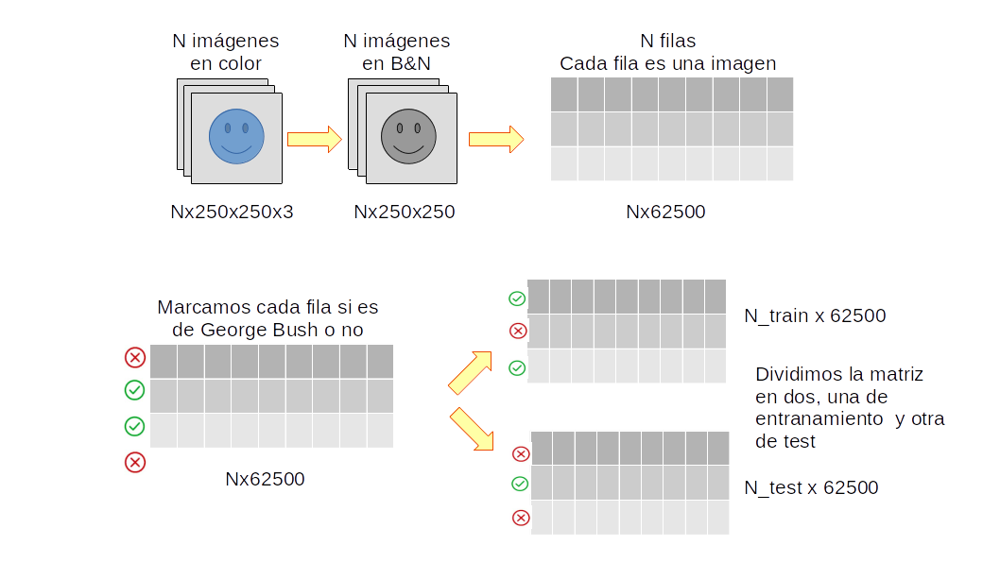
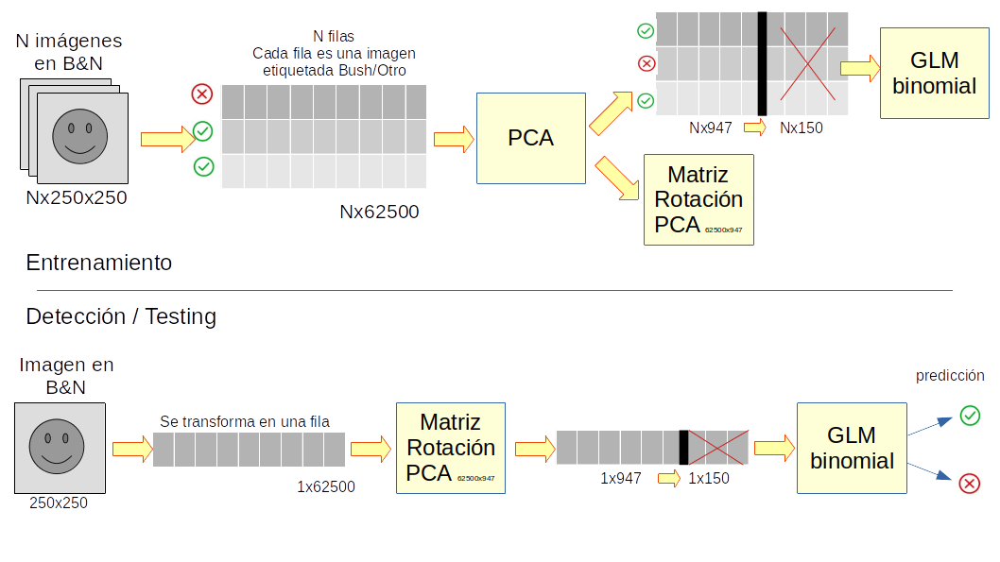

# Eigenfaces

En este ejercicio vamos a ver como aplicar PCA al reconocimiento facial. Esta
técnica originalmente desarrollada por Sirovich y Kirby se
[publicó](http://www.face-rec.org/interesting-papers/General/ld.pdf) en 1987

Vamos a descargarnos un dataset público con miles de imágenes de más de 5000
personas. Cada imagen tiene tiene una resolución de 250x250px y han sido
colocadas de tal forma que la cara siempre se encuentra en la misma posición.

Con esto vamos a hacer un algoritmo que nos diga si una foto pertenece a George
W. Bush o no.

## 1. Descarga de datos

Primero creamos el directorio donde se descargarán las imágenes.

Después con la función `curl_download` descargamos la fotos comprimidas en
formato tgz. Ocupa unos 233Mbytes. La imágenes descomprimidas ocuparán unos
289Mbytes.

```{r}
ext_dir<-'data/faces'
dir.create(ext_dir)
```

```{r}
library(curl)
out_file<-'data/faces/faces.tgz'
curl_download('http://vis-www.cs.umass.edu/lfw/lfw-funneled.tgz',out_file,quiet=FALSE)
```

```{r}
untar(out_file,exdir=ext_dir)
```

```{r}
list.files(ext_dir)
```

```{r}
ext_dir<-'data/faces'
list.files(paste0(ext_dir,'/lfw_funneled'))
```

```{r}
name<-'Serena_Williams'
#name<-'David_Beckham'
name<-'Jacques_Chirac'

name<-'Colin_Powell'
name<-'Donald_Rumsfeld'
name<-'Gerhard_Schroeder'
name<-'Tony_Blair'
name<-'Jose_Maria_Aznar'
#name<-'Juan_Carlos'
#name<-'Ariel_Sharon'
name<-'Hugo_Chavez'
#name<-'George_W_Bush'
list.files(paste0(ext_dir,'/lfw_funneled/',name))
```

### Ayuda:

Desde Jupyter también podemos abrir un Terminal y ejecutar los comandos
directamente desde la consola. Para ello hay que ir a:
http://localhost:8888/tree y desde ahí: New -\> Terminal

## 2. Carga de imágenes

Vamos a usar la librería `jgpeg` para cargar las imágenes.

Creamos una función que convierte las imágenes de color a blanco y negro.

```{r}
library(jpeg)
```

```{r}
get_pic<-function(name,id,root_path=ext_dir,bw=FALSE){    
    img <- tryCatch(
        readJPEG(paste0(root_path,'/lfw_funneled/',name,'/',name,'_',sprintf('%04d',id),'.jpg')),
        error=function(e) return(NULL))
    if (!is.null(img) && bw){
        img<-(img[,,1]+img[,,2]+img[,,3])/3
    }
    img
}
```

```{r}
img <- get_pic('Tony_Blair',id=2, bw=T, root_path=ext_dir)
paste("Dimesiones:",paste0(dim(img),collapse = 'x'))
paste("Tipo:",class(img))

options(repr.plot.height=4,repr.plot.width=4)
plot(1:2, type='n')
rasterImage(img, 1, 1, 2,2)
```

```{r}
dim(img)<-c(1,250*250)
dim(img)
```

```{r}
hist(img)
```

## 3. Transformación de imágenes

Convertimos la matriz de todas las imágenes de 250x250 en 1x62500

Cargamos todas las imágenes de George W. Bush y de otros personajes, y las
guardamos en un array de $N\times62500$

A continuación dividimos esa matriz en dos, una para entrenamiento y otra para
testing.

```{r}
img<-rbind(img,img)
dim(img)
```

```{r}
get_all_pics_for<-function(name){
    i<-0        
    list_imgs<-list()
    repeat{
        i<-i+1
        img <- get_pic(name,id=i,bw=TRUE)
        if(is.null(img)){
            break
        }
        dim(img)<-c(1,250*250)
        list_imgs[[i]]<-img
    }    
    do.call("rbind", list_imgs)
}
```

```{r}
name<-'George_W_Bush'
pics_bush<-get_all_pics_for(name)
dim(pics_bush)
```

```{r}
pics_other<-get_all_pics_for('Ariel_Sharon')
for (name in c('Jose_Maria_Aznar','Hugo_Chavez','Tony_Blair','Colin_Powell',
               'Donald_Rumsfeld','Vladimir_Putin','Junichiro_Koizumi','Arnold_Schwarzenegger')){
    imgs<-get_all_pics_for(name)
    pics_other<-rbind(pics_other,imgs)
}
dim(pics_other)
```

```{r}
set.seed(1)
idx_bush<-sample(1:nrow(pics_bush),0.7*nrow(pics_bush),)
train_bush<-pics_bush[idx_bush,]
test_bush <-pics_bush[-idx_bush,]

idx_other<-sample(1:nrow(pics_other),0.7*nrow(pics_other),)
train_other<-pics_other[idx_other,]
test_other <-pics_other[-idx_other,]
```

```{r}
train_matrix<-rbind(train_bush,train_other)
dim(train_matrix)

test_matrix <-rbind(test_bush,  test_other)
dim(test_matrix)
```

```{r}
rownames(train_matrix)<-c(rep("bush",nrow(train_bush)),rep("other",nrow(train_other)))
rownames(test_matrix) <-c(rep("bush",nrow(test_bush)),rep("other",nrow(test_other)))
```

```{r}
train_matrix[sample(1:nrow(train_matrix),10),1:10]
```



```{r}
plot_row_image<-function(row){
    img<-matrix(row,ncol = sqrt(length(row)))
    plot(1:2, type='n')
    rasterImage(img, 1, 1, 2,2)
}
plot_row_image(train_matrix[500,])
```

## 4. Aplicamos PCA

Sobre la matriz de $train$ aplicamos PCA.

El resultado debería ser una matriz con 62500 autovectores de dimensión 62500.
Pero dado que el número de fotos en training es de solo 947 (menor de 62500),
los autovalores correspondientes a los autovectores desde 948 hasta 62500 son 0.
Por ese motivo solo habra 947 autovectores de dimensión 62500.

#### Mejoras de R

Aquí estamos trabajando con matrices muy grandes y R por defecto es monohilo.
Pero para acelerar operaciones de álgegra lineal se puede aprovechar de las
librerías BLAS. Las teneis para

\* windows: https://mran.microsoft.com/open

\* Linux/Mac: https://github.com/xianyi/OpenBLAS

\* En sistemas tipo debian basta con instalar la libreria `libopenblas-dev`:
apt-get install libopenblas-dev

```{r}
pr_pics<-prcomp(train_matrix,center = TRUE, scale. = TRUE)
```

Partimos de la matriz original de training con 947 imágenes: $$
A=\begin{bmatrix}
0.1 & 0.6 & \cdots  & 0.1 \\ 
0 & 0.2 & \cdots & 0.5 \\ 
\vdots  &  & \ddots  & \vdots \\ 
0.3 & 0.7  & \cdots & 0.1
\end{bmatrix} \in \mathbb{R}^{947\times62500} \Rightarrow estandarizamos ~ \frac{x-\mu}{\sigma} \Rightarrow  covariaza \Rightarrow \begin{bmatrix}
0.05 & 0.06 & \cdots  & 0.03 \\ 
0.07 & 0.03 & \cdots & 0.01 \\ 
\vdots  &  & \ddots  & \vdots \\ 
0.02 & 0.08  & \cdots & 0.021
\end{bmatrix}_{62500\times62500} 
$$

Calculamos los autovectores y autovalores de la matriz de covarianza.

Tendremos 62500 autovalores: $$
\lambda=\begin{bmatrix}
118 & 59.6 & 55.8 & \cdots & 1 & 0.9 & 1e-14 & 0 & \cdots & 0 
\end{bmatrix}_{1 \times 62500}
$$ De los cuales solo los 947 primeros tendrán un valor superior a 0. Con lo
cual podemos simplificar como: $$
\lambda=\begin{bmatrix}
118 & 59.6 & 55.8 & \cdots & 1 & 0.9 & 1e-14 
\end{bmatrix}_{1 \times 947}
$$

Si tenemos 947 autovalores no nulos, solo necesitaremos los correspondientes 947
autovectores:

$$
V=\begin{bmatrix}
0.002516356 & 0.0005953821& \cdots  & 0.0060715542 \\ 
0.002536501 & 0.0006830596 & \cdots  & 0.0495874353 \\
\vdots     &               & \ddots  & \vdots \\ 
0.001588527 &   -0.0003561657 & \cdots & -0.0005549179
\end{bmatrix}_{62500\times 947}
$$

```{r}
str(pr_pics)
```

```{r}
# Matriz de autovalores
pr_pics$sdev[1:10]
```

```{r}
# Matriz de autovectores
pr_pics$rotation[sample(1:nrow(pr_pics$rotation),5),1:10]
```

### Transformando en el dominio PC

Podemos transformar una imagen en sus componentes principales multiplicándo por
la matrix de autovectores el vector imagen estandarizado:

Dada una imagen convertida en un vector A_i: $$
A_i=\begin{bmatrix}
0.1 & 0.6 & & 0.5 \cdots  & 0.1 \\ 
\end{bmatrix}_{[1 \times 62500]}
$$

Calculamos su valor estandarizado: $$
A_{ij}'=\frac{A_{ij}-\mu_{j}}{\sigma_j}
$$ Donde: $$
\mu_j=\frac{\sum_i^n{A_{ij}}}{n}
$$ $$
\sigma^2_j=\frac{\sum_i^n ({A_{ij}-\mu_j})^2}{n}
$$

Después calculamos la matrix de componentes principales multiplicando
$A' \times V$: $$
A_{PC} = A'_{947\times62500} \times V_{62500\times947} \in \mathbb{R}^{947\times947}
$$

```{r}
#Matriz de componentes principales
dim(pr_pics$rotation)
```

```{r}
#pr_pics$x[sample(1:nrow(pr_pics$x),5),1:10]
pr_pics$x[1,1:10]
```

```{r}
pic_pca<-(matrix((train_matrix[1,]-pr_pics$center)/pr_pics$scale,nrow=1) %*% pr_pics$rotation)
pic_pca[1:10]
dim(pic_pca)
```

```{r}
predict(pr_pics, newdata = train_matrix[1:2,])[1:2,1:10]
```

### Transformando de vuelta al dominio de las imágenes

Dada la matriz de componentes principales, podemos obtener la matriz original
**sin nigún perdida de información** si multiplicamos por la inversa de la
matriz de autovectores.

La matriz de autovectores es una matriz ortonormal. Eso significa que la
transpuesta es su propia inversa ya que: $$
V \times V^T=I
$$ Así pues:

$$
A_{PC_{947\times947}} = A'_{947\times62500} \times V_{62500\times947} \\
A_{PC_{947\times947}} \times V^T_{947\times62500} = A'_{947\times62500} \times V_{62500\times947} \times V^T_{947\times62500} \\
A_{PC_{947\times947}} \times V^T_{947\times62500} = A'_{947\times62500} \times I_{62500\times62500}\\
A_{PC_{947\times947}} \times V^T_{947\times62500} = A'_{947\times62500}
$$

Es decir, el vector que contiene la imagen original normalizada se puede obtener
como: $$
A'=A_{PC} \times V^T
$$

Después desnormalizamos $A'$ para volver al vector original de la imagen: $$
A_{ij}=A'_{ij}·\sigma_j+\mu_{j}
$$

```{r}
recover_pic<-(pic_pca %*% t(pr_pics$rotation))*pr_pics$scale+pr_pics$center
summary(array(recover_pic))
#El valor de un pixel siempre está entre 0 y 1, errores en el redondeo hace que a veces esto no se cumpla. 
recover_pic[recover_pic<0]<-0
recover_pic[recover_pic>1]<-1
dim(recover_pic)
```

En este proceso se producen errores de rendodeo. Es por eso que deben ser
ajustados y limitar el rango de la imagen a \[0,1\] La codificación de los
números en binario se hace siguiendo el estandar [IEEE
754](https://en.wikipedia.org/wiki/IEEE_754)


```{r}
bin2dec <- function(binaryvector) {
  sum(2^(which(rev(binaryvector))-1))
}
fracbin2dec <- function(frac) {
  sum(2^(-which(frac)))
}
xp<-c(F,T,T,T,T,T,F,F)
frac<-c(F,T,F,F,F,F,F,F,F,F,F,F,F,F,F,F,F,F,F,F,F,F,F)

2^(bin2dec(xp)-127)*(1+fracbin2dec(frac))
```

```{r}
#Comprobamos que hemos podido recuperar la imagen original
plot_row_image(recover_pic)
```

### Importancia de los autovectores

Podemos pintar el valor de los autovectores. Recordemos los autovectores
representan la desviación típica de la muestra de datos en la dirección marcada
por su correspondiente autovector.

Si ordenamos los autovalores por su valor veremos como la mayor parte de la
variación se encuentra en los primeros autovalores. El resto aportan cada vez
menos información.

```{r}
plot(log10(pr_pics$sdev),t='l',ylim = c(0,2))
```

```{r}
t_pic<-matrix(rep(0,ncol(pr_pics$rotation)),nrow=1)
t_pic[1]<-1
#t_pic[1:50]<-1
#t_pic[500]<-1


pic_normalizada<-t_pic %*% t(pr_pics$rotation)
summary(array(pic_normalizada))
pic_normalizada<-(pic_normalizada-min(pic_normalizada))
pic_normalizada<-pic_normalizada/max(pic_normalizada)
plot_row_image(pic_normalizada)
```

Una vez que tenemos una imagen transformada con sus componentes principales
podemos borrar los que corresponen a autovalores con menor peso.

De esta forma estaremos perdiendo información, pero la mínima posible, con lo
cual la reconstrucción posterior de la imagen seguirá siendo posible, aunque con
perdidas.

Se puede demostrar que para las imágenes del conjunto de train, si las pasamos
al dominio de PCA, eliminamos los componentes menos importantes y las volvemos a
transformar al dominio de las imágenes. Estas habrán sufrido una perdida de
información mínima, es una compresión con perdidas muy eficiente.

Pero es más, si utilizamos una imagen de test y aplicamos el mismo proceso,
aunque el resultado no será tan bueno, también veremos como es suficientemente
bueno. Este método se puede utilizar para comprimir imágenes que comparten
características comunes.

```{r}
# Por motivos didácticos crearemos una función similar a predict:
transform_pca<-function(pca_result=pr_pics,row){
    v <-matrix(row,nrow=1)
    v_normalizada<- (v-pca_result$center)/pca_result$scale
    v_normalizada %*% pca_result$rotation    
}

# Y una función que haga su inversa:
inv_transform_pca<-function(pca_result=pr_pics,row){
    v <-matrix(row,nrow=1)    
    pic_normalizada<-v %*% t(pca_result$rotation)
    pic<-pic_normalizada*pca_result$scale+pca_result$center
    pic[pic<0]<-0
    pic[pic>1]<-1
    pic
}
```

```{r}
#orig_pic<-train_matrix[600,]
orig_pic<-test_matrix[200,]

number_of_pca_components <- 947
t_pic<-transform_pca(row=orig_pic)
t_pic[number_of_pca_components:length(t_pic)]<-0
dim(t_pic)

pic<-inv_transform_pca(row=t_pic)
plot_row_image(pic)
plot_row_image(orig_pic)
```

Recordemos que el PCA trabaja con valores centrados en 0 y desviación típica 1.
Por eso hemos normalizado.

Los coeficientes del PCA simplemente dicen cuanto se desplaza el valore real
respecto a la media en las direcciones de máxima dispersión. Es así como se
consigue la compresión.

Si nos fijamos en la media de todas las caras, vemos que parece una cara, lo que
guardaríamos en el PCA es la diferencia de una cara respecto a otra.

```{r}
plot_row_image(pr_pics$center)
```

```{r}
mean_face<-colSums(train_matrix)/nrow(train_matrix)
plot_row_image(mean_face)
```

## 5. Clasificación usando PCA

Ya tenemos todos componentes principales de las imágenes. Estos componentes
principales están alineados con la dirección de máxima varianza.

Así pues podemos construir un clasificador fijándonos únicamente en los primeros
componentes principales. La imagen que más se acerque tendrá más posibilidades
de ser de la misma persona.

```{r}
number_of_pca_components<-200

id_test_pic<-74
#id_test_pic<-124
#id_test_pic<-1

orig_pic<-test_matrix[id_test_pic,]

t_pic<-transform_pca(row=orig_pic)
t_pic<-matrix(t_pic[1:number_of_pca_components],nrow=1)
```

```{r}
Apc<-pr_pics$x[,1:number_of_pca_components]
dist<-rep(NA,nrow(Apc))
for (i in 1:nrow(Apc)){
    dist[i]<-sum((t_pic-Apc[i,])^2)
}
# Equivalente a:
#dist<-rowSums((t_pic[rep(1, times = nrow(pr_pics$x)), ]-pr_pics$x)^2)
```

```{r}
#El clasificador dice que la foto más parecida es esta:
which.min(dist)
```

```{r}
plot_row_image(train_matrix[which.min(dist),])
plot_row_image(orig_pic)
```

```{r}
paste("La imagen es de:",
rownames(test_matrix)[id_test_pic],
      "el clasificador dice que es de:",
      rownames(train_matrix)[which.min(dist)])
      
```

## K-nearest neighbor

Esto es equivalente a un KNN con N=1


Calculemos la matriz de confianza.

```{r}
number_of_pca_components<-200

result<-data.frame(real=rownames(test_matrix),pred=NA, stringsAsFactors = T)
Apc<-pr_pics$x[,1:number_of_pca_components]

for (id_test_pic in 1:nrow(test_matrix)){

    orig_pic<-test_matrix[id_test_pic,]

    t_pic<-transform_pca(row=orig_pic)[,1:number_of_pca_components]
    t_pic<-matrix(t_pic,nrow=1)
        
    dist<-rowSums((t_pic[rep(1, times = nrow(Apc)), ]-Apc)^2)    
    
    result$pred[id_test_pic]<-rownames(train_matrix)[which.min(dist)]
}
```

```{r}
result$pred=as.factor(result$pred)
str(result)
```

```{r}
library(caret)
```

```{r}
confusionMatrix(data = result$pred, reference= result$real)
```

```{r}
sum(result$real=="bush")
```

```{r}
sum(result$pred=="bush")
```

```{r}
# Más información de como obtener esas figuras:
# https://www.rdocumentation.org/packages/caret/versions/6.0-85/topics/confusionMatrix
Pra<-sum(result$real==result$pred)/nrow(result)

paste("Accuracy:",sum(result$real==result$pred)/nrow(result))
Pr_bush<-sum(result$real=="bush")/nrow(result)
Pr_other<-sum(result$real=="other")/nrow(result)
Pd_bush<-sum(result$pred=="bush")/nrow(result)
Pd_other<-sum(result$pred=="other")/nrow(result)

Pre<-Pr_bush*Pd_bush+Pr_other*Pd_other
paste("Kappa:",(Pra-Pre)/(1-Pre))

paste("Sensibilidad:",sum(result$pred=="bush" & result$real=="bush")/sum(result$real=="bush"))
paste("Especifidad:",sum(result$pred=="other" & result$real=="other")/sum(result$real=="other"))
paste("Pr pred:",sum(result$pred=="bush" & result$real=="bush")/sum(result$pred=="bush"))
```

```{r}
number_of_pca_components<-100
knn<-5

result<-data.frame(real=rownames(test_matrix),pred=NA)
Apc<-pr_pics$x[,1:number_of_pca_components]

for (id_test_pic in 1:nrow(test_matrix)){

    orig_pic<-test_matrix[id_test_pic,]

    t_pic<-transform_pca(row=orig_pic)[,1:number_of_pca_components]
    t_pic<-matrix(t_pic,nrow=1)
        
    dist<-rowSums((t_pic[rep(1, times = nrow(Apc)), ]-Apc)^2)    
    
    knn_tags<-rownames(train_matrix)[order(dist,decreasing = F) %in% c(1:knn)]
    
    #most_common_name<-names(sort(table(knn_tags),decreasing = T))[1]
    most_common_name<-names(which.max(table(knn_tags)))
    
    result$pred[id_test_pic]<-most_common_name
}
```

```{r}
most_common_name
```

```{r}
result$pred=as.factor(result$pred)
confusionMatrix(table(result$pred,result$real))
```

```{r}
result$pred=as.factor(result$pred)
confusionMatrix(table(result$pred,result$real))
```

## Cluster

```{r}
A<-pr_pics$x[,1:200]

d <- dist(A,method = "euclidean")
hc <- hclust(d,method="average")
hcd <- as.dendrogram(hc)
plot(hcd)
table(rownames(A),cutree(hc,h=350))
```

```{r}
library(dbscan)
cl <- hdbscan(pr_pics$x[,1:3], minPts = 10,gen_hdbscan_tree=TRUE)
cl
```

```{r}
plot(cl)
```

```{r}
table(cl$cluster,rownames(pr_pics$x))
```

```{r}
which(cl$cluster==1)
```

```{r}
plot_row_image(train_matrix[865,])
```

### Regresión logistica

Podemos mejorar el algoritmo, en lugar de usar un KNN podemos usar una regresión
logistica sobre los componenetes principales más importantes.

```{r}
number_of_pca_components<-150
df_train<-data.frame(pr_pics$x[,1:number_of_pca_components])
df_train$name<-as.factor(rownames(pr_pics$x))
head(df_train)
```

```{r}
model<-glm(df_train,formula="name~.",family=binomial)
summary(model)
```

```{r}
summary(model$fitted.values)
```

```{r}
confusionMatrix(data=as.factor(ifelse(model$fitted.values<0.5,'bush','other')),                
                reference=df_train$name)
```

```{r}
test_pics_pca<-predict(pr_pics,test_matrix)
df_test<-data.frame(test_pics_pca[,1:number_of_pca_components])
df_test$name<-as.factor(rownames(test_pics_pca))
head(df_test)
```

```{r}
pred_test_glm <- predict(model,df_test)
head(pred_test_glm)
```

```{r}
df_result<-data.frame(real=df_test$name,
                      pred=pred_test_glm,row.names = NULL)
```

```{r}
summary(df_result)
```

```{r}
df_result$pred_name<-as.factor(ifelse(df_result$pred<0,'bush','other'))
confusionMatrix(data=df_result$pred_name,reference=df_result$real)
```

```{r}
library(ROCR)

#Con type="response" utilizamos la salida de la link function, 
# pasa por la función sigmoidal (inversa de logit) y devuelve un valor en el rango [0,1] 
df_result$p<-predict(model,df_test,type="response")

pr <- prediction(df_result$p, df_test$name)
prf <- performance(pr, measure = "tpr", x.measure = "fpr")
plot(prf)
```

```{r}
prf <- performance(pr, measure = "prec", x.measure = "rec")
plot(prf)
```

```{r}
performance(pr, measure = "auc")@y.values
```



#### Ejemplo con regularización

```{r}
number_of_pca_components<-150
df_train<-data.frame(pr_pics$x[,1:number_of_pca_components])
df_train$name<-as.factor(rownames(pr_pics$x))
head(df_train)
```

```{r}
#model<-glm(df_train,formula="name~.",family=binomial)

cvfit<-glmnetUtils::cv.glmnet(name~.,
                              family = "binomial",
                              data=df_train,nfolds=10,alpha=1)
plot(cvfit)
```

```{r}
test_pics_pca<-predict(pr_pics,test_matrix)
df_test<-data.frame(test_pics_pca[,1:number_of_pca_components])
df_test$name<-as.factor(rownames(test_pics_pca))
```

```{r}
p<-predict(cvfit,newdata=df_test,s=cvfit$lambda.min)

pr <- prediction(p, df_test$name)
prf_auc=performance(pr, measure = "auc")
paste("The AUC is",prf_auc@y.values[[1]])
```

```{r}
df_result$pred_name<-as.factor(ifelse(p<0,'bush','other'))
confusionMatrix(table(df_result$pred_name,df_result$real))
```

```{r}
coef(cvfit,s=cvfit$lambda.min)
```
